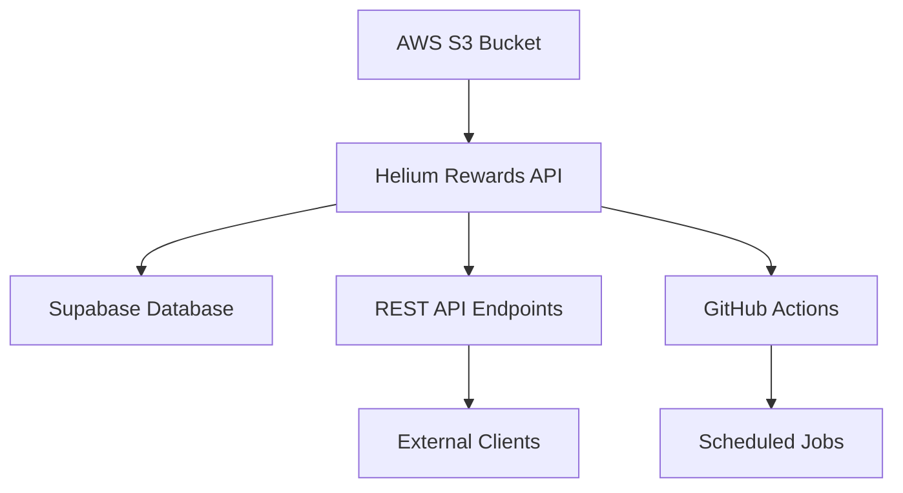
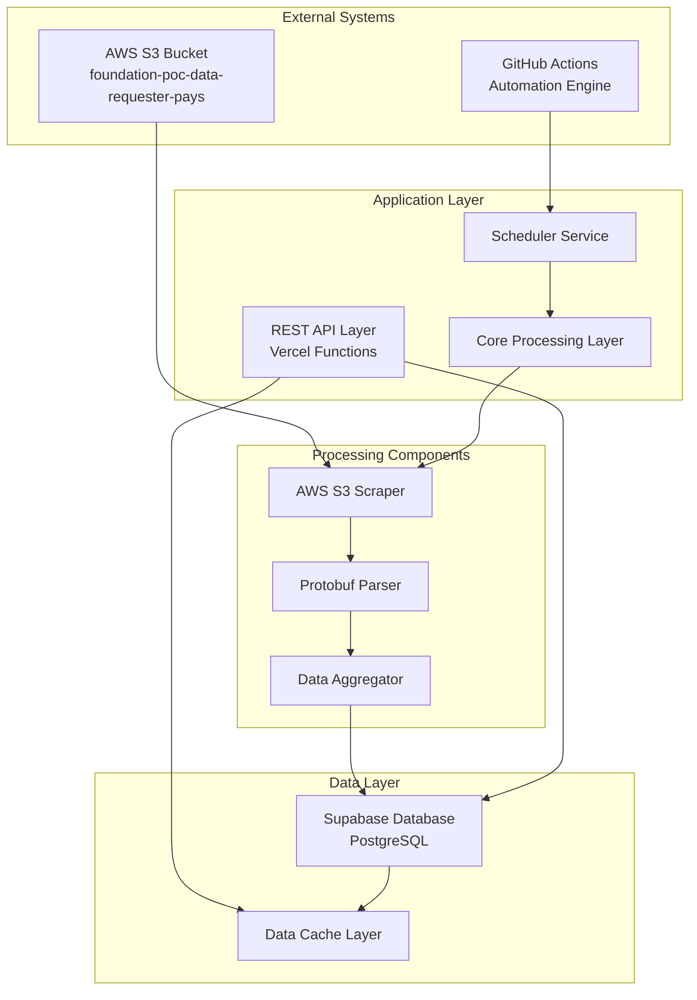
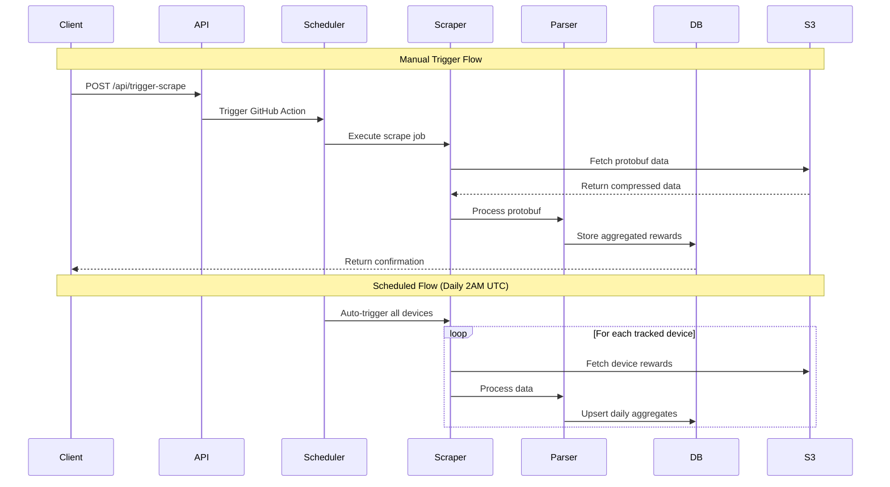
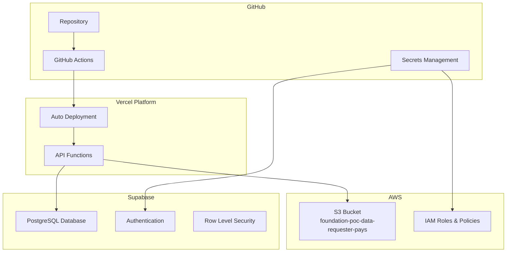
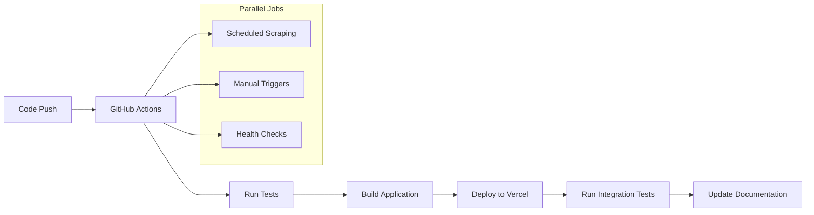
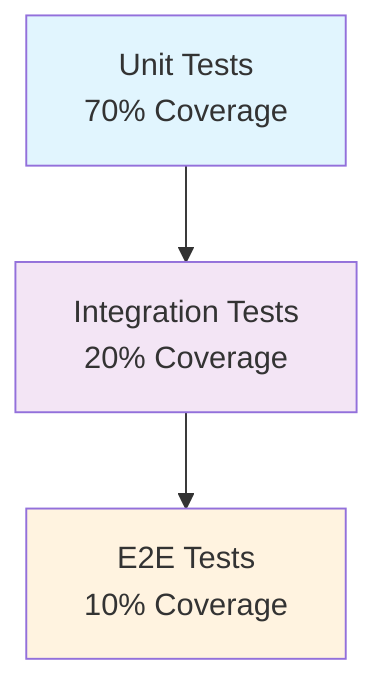

# Software Design Document (SDD)
## Helium Rewards API

**Version:** 1.0  
**Date:** September 17, 2025  
**Author:** Development Team  
**Status:** Draft  

---

## Table of Contents

1. [Executive Summary](#1-executive-summary)
2. [System Overview](#2-system-overview)
3. [Architecture Design](#3-architecture-design)
4. [Data Design](#4-data-design)
5. [Component Design](#5-component-design)
6. [Interface Design](#6-interface-design)
7. [Deployment Architecture](#7-deployment-architecture)
8. [Security Design](#8-security-design)
9. [Performance Requirements](#9-performance-requirements)
10. [Testing Strategy](#10-testing-strategy)
11. [Risk Assessment](#11-risk-assessment)
12. [Appendices](#12-appendices)

---

## 1. Executive Summary

### 1.1 Purpose
The Helium Rewards API is a comprehensive data aggregation and analysis system designed to extract, process, and serve Helium network device reward data from AWS S3 storage. The system provides automated daily scraping, historical data analysis, and RESTful API access to reward metrics.

### 1.2 Scope
- **Primary Function**: Automated extraction and processing of Helium device rewards from AWS S3 protobuf data
- **Secondary Functions**: Historical data analysis, device management, scheduled automation
- **Target Users**: Helium network operators, data analysts, third-party integrators

### 1.3 Key Features
- Real-time AWS S3 data extraction with protobuf decoding
- Automated daily reward aggregation and historical tracking
- RESTful API for data querying and device management
- GitHub Actions-based automation and scheduling
- Comprehensive audit trails and error handling

---

## 2. System Overview

### 2.1 System Context


### 2.2 System Architecture Pattern
**Architecture Style**: Microservices with Event-Driven Components  
**Design Pattern**: Repository Pattern with Service Layer  
**Data Pattern**: CQRS (Command Query Responsibility Segregation)

### 2.3 Technology Stack
- **Runtime**: Node.js 18+
- **Cloud Storage**: AWS S3
- **Database**: Supabase (PostgreSQL)
- **API Framework**: Vercel Serverless Functions
- **Automation**: GitHub Actions
- **Data Format**: Protocol Buffers (protobuf)
- **Authentication**: AWS IAM, Supabase RLS

---

## 3. Architecture Design

### 3.1 High-Level Architecture



### 3.2 Component Interaction Flow



### 3.3 Data Flow Architecture

```mermaid
graph LR
    subgraph "Ingestion Pipeline"
        A[S3 List Objects] --> B[Download .gz Files]
        B --> C[Decompress gzip]
        C --> D[Parse Protobuf Frames]
        D --> E[Filter Target Device]
        E --> F[Extract Reward Data]
    end
    
    subgraph "Processing Pipeline"
        F --> G[Validate Data]
        G --> H[Aggregate Daily Totals]
        H --> I[Calculate Statistics]
        I --> J[Store in Database]
    end
    
    subgraph "Serving Pipeline"
        J --> K[API Query Layer]
        K --> L[Response Formatting]
        L --> M[Client Response]
    end
```



---

## 4. Data Design

### 4.1 Database Schema

```sql
-- Core device registry
CREATE TABLE devices (
    id UUID PRIMARY KEY DEFAULT gen_random_uuid(),
    device_key TEXT UNIQUE NOT NULL,
    device_name TEXT,
    description TEXT,
    is_active BOOLEAN DEFAULT true,
    created_at TIMESTAMP WITH TIME ZONE DEFAULT NOW(),
    updated_at TIMESTAMP WITH TIME ZONE DEFAULT NOW()
);

-- Daily rewards aggregation
CREATE TABLE helium_rewards_daily (
    id UUID PRIMARY KEY DEFAULT gen_random_uuid(),
    transaction_date DATE NOT NULL,
    device_key TEXT NOT NULL,
    device_id UUID REFERENCES devices(id),
    reward_amount_dc BIGINT NOT NULL DEFAULT 0,
    reward_type TEXT NOT NULL DEFAULT 'mobile_verified',
    data_source TEXT NOT NULL,
    raw_data JSONB,
    created_at TIMESTAMP WITH TIME ZONE DEFAULT NOW(),
    updated_at TIMESTAMP WITH TIME ZONE DEFAULT NOW(),
    
    CONSTRAINT unique_daily_device_reward UNIQUE (transaction_date, device_id, reward_type)
);

-- Scheduled scraping tracking
CREATE TABLE tracked_devices (
    id UUID PRIMARY KEY DEFAULT gen_random_uuid(),
    device_key TEXT NOT NULL REFERENCES devices(device_key),
    added_to_tracked_at TIMESTAMP WITH TIME ZONE DEFAULT NOW(),
    last_scraped TIMESTAMP WITH TIME ZONE,
    is_active BOOLEAN DEFAULT true,
    notes TEXT,
    scrape_frequency INTERVAL DEFAULT '1 day',
    
    CONSTRAINT unique_tracked_device UNIQUE (device_key)
);

-- Audit and logging
CREATE TABLE helium_rewards_scrape_log (
    id UUID PRIMARY KEY DEFAULT gen_random_uuid(),
    device_key TEXT,
    scrape_date TIMESTAMP WITH TIME ZONE DEFAULT NOW(),
    status TEXT NOT NULL CHECK (status IN ('success', 'error', 'partial')),
    records_found INTEGER DEFAULT 0,
    records_processed INTEGER DEFAULT 0,
    date_range_start DATE,
    date_range_end DATE,
    error_message TEXT,
    execution_time_ms INTEGER,
    data_source TEXT,
    metadata JSONB
);

-- Indexes for performance
CREATE INDEX idx_rewards_device_date ON helium_rewards_daily(device_id, transaction_date DESC);
CREATE INDEX idx_rewards_date_range ON helium_rewards_daily(transaction_date);
CREATE INDEX idx_scrape_log_device_date ON helium_rewards_scrape_log(device_key, scrape_date DESC);
CREATE INDEX idx_tracked_devices_active ON tracked_devices(is_active) WHERE is_active = true;
```

### 4.2 Data Models

```typescript
interface Device {
  id: string;
  device_key: string;
  device_name?: string;
  description?: string;
  is_active: boolean;
  created_at: Date;
  updated_at: Date;
}

interface HeliumRewardDaily {
  id: string;
  transaction_date: Date;
  device_key: string;
  device_id: string;
  reward_amount_dc: bigint;
  reward_type: 'mobile_verified' | 'iot_verified' | 'other';
  data_source: string;
  raw_data?: any;
  created_at: Date;
  updated_at: Date;
}

interface TrackedDevice {
  id: string;
  device_key: string;
  added_to_tracked_at: Date;
  last_scraped?: Date;
  is_active: boolean;
  notes?: string;
  scrape_frequency: string; // PostgreSQL interval
}

interface ScrapeLog {
  id: string;
  device_key?: string;
  scrape_date: Date;
  status: 'success' | 'error' | 'partial';
  records_found: number;
  records_processed: number;
  date_range_start?: Date;
  date_range_end?: Date;
  error_message?: string;
  execution_time_ms?: number;
  data_source?: string;
  metadata?: any;
}
```

---

## 5. Component Design

### 5.1 Core Components

#### 5.1.1 AWS S3 Scraper (`src/scrapeHeliumRewards.js`)

**Purpose**: Extract protobuf data from AWS S3 bucket  
**Responsibilities**:
- Authenticate with AWS S3 using IAM credentials
- List and filter objects by date range and data source
- Download and decompress .gz files
- Parse framed protobuf messages
- Filter messages for target devices

```javascript
class HeliumRewardsScraper {
  constructor(config) {
    this.s3Client = new S3Client({ region: config.region });
    this.bucket = config.bucket;
    this.targetDeviceFormats = this.getDeviceFormats(config.deviceKey);
  }
  
  async scrapeDeviceRewards(deviceKey, dateRange) {
    // Implementation details
  }
  
  async *framedMessages(stream) {
    // Protobuf frame parsing generator
  }
  
  containsTargetDevice(message, targetFormats) {
    // Device matching logic
  }
}
```

#### 5.1.2 Protobuf Parser (`src/parseRewardsData.js`)

**Purpose**: Process and validate protobuf reward messages  
**Responsibilities**:
- Decode protobuf messages using @helium/proto
- Extract reward amounts and metadata
- Validate data integrity
- Enrich data with additional formats

```javascript
class RewardsDataParser {
  constructor(protoDecoder) {
    this.decoder = protoDecoder;
  }
  
  parseRewardMessage(buffer) {
    // Decode protobuf and extract reward data
  }
  
  enrichRewardData(rawData) {
    // Add calculated fields and formatting
  }
  
  validateRewardData(data) {
    // Data validation and sanitization
  }
}
```

#### 5.1.3 Database Operations (`src/upsertHeliumRewards.js`)

**Purpose**: Handle all database interactions  
**Responsibilities**:
- Upsert daily reward aggregations
- Manage device tracking
- Create audit trail entries
- Handle data conflicts and deduplication

```javascript
class RewardsDatabaseService {
  constructor(supabaseClient) {
    this.db = supabaseClient;
  }
  
  async upsertDailyRewards(deviceKey, date, rewards) {
    // Aggregate and store daily rewards
  }
  
  async updateDeviceTracking(deviceKey, scrapeResult) {
    // Update last scraped timestamp
  }
  
  async logScrapeOperation(logEntry) {
    // Create audit trail entry
  }
}
```

### 5.2 Service Layer

#### 5.2.1 Orchestration Service (`src/runRewardsScrape.js`)

**Purpose**: Coordinate scraping operations  
**Responsibilities**:
- Orchestrate scraper, parser, and database operations
- Handle error recovery and retries
- Manage transaction boundaries
- Provide progress reporting

#### 5.2.2 Scheduling Service (`src/scheduledRewardsScrape.js`)

**Purpose**: Manage automated scraping schedules  
**Responsibilities**:
- Query tracked devices
- Execute batch scraping operations
- Handle device-specific configurations
- Manage concurrent operations

### 5.3 API Layer

#### 5.3.1 Rewards Query API (`api/helium-rewards.js`)

**Purpose**: Serve reward data via REST API  
**Endpoints**:
- `GET /api/helium-rewards` - Query device rewards with filtering
- **Parameters**: `device_key`, `days`, `start`, `end`, `reward_type`
- **Response**: Aggregated rewards data with statistics

#### 5.3.2 Device Management API (`api/manage-devices.js`)

**Purpose**: Manage device tracking configuration  
**Endpoints**:
- `GET /api/manage-devices` - List tracked devices
- `POST /api/manage-devices` - Add device to tracking
- `DELETE /api/manage-devices` - Remove device from tracking

#### 5.3.3 Scraping Trigger API (`api/trigger-scrape.js`)

**Purpose**: Trigger manual scraping operations  
**Endpoints**:
- `POST /api/trigger-scrape` - Trigger GitHub Action for device scraping

---

## 6. Interface Design

### 6.1 REST API Specification

#### 6.1.1 Helium Rewards Query API

```yaml
openapi: 3.0.3
info:
  title: Helium Rewards API
  version: 1.0.0
  description: Query and manage Helium device rewards data

paths:
  /api/helium-rewards:
    get:
      summary: Query device rewards
      parameters:
        - name: device_key
          in: query
          required: true
          schema:
            type: string
          description: Helium device key (base58check format)
        - name: days
          in: query
          schema:
            type: integer
            minimum: 1
            maximum: 365
          description: Number of days to look back from today
        - name: start
          in: query
          schema:
            type: string
            format: date
          description: Start date (YYYY-MM-DD)
        - name: end
          in: query
          schema:
            type: string
            format: date
          description: End date (YYYY-MM-DD)
        - name: reward_type
          in: query
          schema:
            type: string
            enum: [mobile_verified, iot_verified, all]
          description: Filter by reward type
      responses:
        '200':
          description: Successful response
          content:
            application/json:
              schema:
                type: object
                properties:
                  device_key:
                    type: string
                  range:
                    type: object
                    properties:
                      start: { type: string, format: date }
                      end: { type: string, format: date }
                      days: { type: integer }
                  count:
                    type: integer
                  summary:
                    type: object
                    properties:
                      total_dc_rewards: { type: integer }
                      average_daily_dc: { type: number }
                      max_daily_dc: { type: integer }
                      min_daily_dc: { type: integer }
                      active_days: { type: integer }
                      uptime_percentage: { type: number }
                  data:
                    type: array
                    items:
                      type: object
                      properties:
                        transaction_date: { type: string, format: date }
                        reward_amount_dc: { type: integer }
                        reward_type: { type: string }
                        data_source: { type: string }
```

### 6.2 Internal Interfaces

#### 6.2.1 Scraper Interface

```typescript
interface ScraperConfig {
  region: string;
  bucket: string;
  deviceKey: string;
  dateRange: {
    start: Date;
    end: Date;
  };
  dataSources: DataSource[];
}

interface ScraperResult {
  deviceKey: string;
  rewards: RewardEntry[];
  metadata: {
    filesProcessed: number;
    messagesFound: number;
    dateRange: DateRange;
    executionTime: number;
  };
}
```

#### 6.2.2 Parser Interface

```typescript
interface ParsedReward {
  deviceKey: string;
  rewardAmount: bigint;
  rewardType: string;
  timestamp: Date;
  dataSource: string;
  rawMessage: any;
  enrichedData: EnrichedData;
}
```

---

## 7. Deployment Architecture

### 7.1 Infrastructure Overview



### 7.2 Environment Configuration

#### 7.2.1 Development Environment
- **Local Development**: Node.js with dotenv configuration
- **Database**: Local Supabase instance or development database
- **AWS**: Development IAM user with limited S3 permissions
- **Testing**: Jest test suite with mocked AWS services

#### 7.2.2 Production Environment
- **API Hosting**: Vercel serverless functions
- **Database**: Supabase production instance
- **AWS**: Production IAM role with restricted S3 access
- **Monitoring**: Vercel Analytics + Supabase monitoring
- **Secrets**: GitHub Secrets + Vercel Environment Variables

### 7.3 CI/CD Pipeline



---

## 8. Security Design

### 8.1 Authentication & Authorization

#### 8.1.1 AWS S3 Access
- **Method**: IAM roles with least privilege access
- **Permissions**: Read-only access to specific S3 bucket
- **Requester Pays**: Configured for cost attribution

#### 8.1.2 Database Security
- **Authentication**: Supabase service role keys
- **Authorization**: Row Level Security (RLS) policies
- **Connection**: SSL/TLS encrypted connections

#### 8.1.3 API Security
- **Rate Limiting**: Vercel built-in rate limiting
- **CORS**: Configured for specific origins
- **Input Validation**: Comprehensive parameter validation

### 8.2 Data Security

#### 8.2.1 Data at Rest
- **Database**: Supabase encryption at rest
- **Secrets**: GitHub Secrets encryption
- **Logs**: Structured logging without sensitive data

#### 8.2.2 Data in Transit
- **API**: HTTPS/TLS 1.3 encryption
- **Database**: SSL connections
- **AWS**: TLS for all S3 operations

### 8.3 Secrets Management

```yaml
# GitHub Secrets
AWS_ACCESS_KEY_ID: <encrypted>
AWS_SECRET_ACCESS_KEY: <encrypted>
SUPABASE_URL: <encrypted>
SUPABASE_SERVICE_ROLE_KEY: <encrypted>
GITHUB_TOKEN: <encrypted>

# Vercel Environment Variables
AWS_REGION: us-west-2
AWS_BUCKET: foundation-poc-data-requester-pays
GITHUB_REPOSITORY: username/helium-rewards-api
```

---

## 9. Performance Requirements

### 9.1 Response Time Requirements

| Operation | Target Response Time | Maximum Response Time |
|-----------|---------------------|----------------------|
| API Query (7 days) | < 500ms | < 2s |
| API Query (30 days) | < 1s | < 5s |
| Device Scraping | < 5 minutes | < 15 minutes |
| Batch Scraping (10 devices) | < 30 minutes | < 60 minutes |

### 9.2 Throughput Requirements

| Metric | Target | Maximum |
|--------|--------|---------|
| API Requests/minute | 100 | 500 |
| Concurrent Scraping Jobs | 5 | 10 |
| Daily Devices Processed | 100 | 500 |
| S3 Objects/minute | 50 | 200 |

### 9.3 Scalability Considerations

#### 9.3.1 Horizontal Scaling
- **API Layer**: Vercel auto-scaling serverless functions
- **Database**: Supabase connection pooling
- **Processing**: GitHub Actions concurrent job limits

#### 9.3.2 Vertical Scaling
- **Memory**: Configurable function memory limits
- **CPU**: Automatic scaling based on workload
- **Storage**: Unlimited database storage scaling

### 9.4 Performance Optimization

#### 9.4.1 Caching Strategy
- **API Responses**: Edge caching for static queries
- **Database Queries**: Connection pooling and query optimization
- **S3 Data**: Local caching of frequently accessed objects

#### 9.4.2 Database Optimization
- **Indexing**: Strategic indexes on query patterns
- **Partitioning**: Date-based partitioning for large tables
- **Archiving**: Automated archiving of old data

---

## 10. Testing Strategy

### 10.1 Testing Pyramid



### 10.2 Test Categories

#### 10.2.1 Unit Tests
- **Scope**: Individual functions and classes
- **Framework**: Jest
- **Coverage**: Minimum 80% code coverage
- **Focus Areas**:
  - Protobuf parsing logic
  - Data validation functions
  - Database query builders
  - Utility functions

#### 10.2.2 Integration Tests
- **Scope**: Component interactions
- **Framework**: Jest with test containers
- **Focus Areas**:
  - AWS S3 client integration
  - Database operations
  - API endpoint functionality
  - GitHub Actions workflows

#### 10.2.3 End-to-End Tests
- **Scope**: Complete user workflows
- **Framework**: Playwright or similar
- **Focus Areas**:
  - Full scraping pipeline
  - API query workflows
  - Error handling scenarios

### 10.3 Test Data Management

#### 10.3.1 Mock Data
- **S3 Mock**: Mocked AWS SDK responses
- **Database Mock**: In-memory test database
- **Protobuf Mock**: Sample protobuf messages

#### 10.3.2 Test Environment
- **Isolation**: Each test run uses fresh data
- **Cleanup**: Automated test data cleanup
- **Seeding**: Consistent test data seeding

---

## 11. Risk Assessment

### 11.1 Technical Risks

| Risk | Probability | Impact | Mitigation Strategy |
|------|------------|--------|-------------------|
| AWS S3 Rate Limiting | Medium | High | Implement exponential backoff and request throttling |
| Protobuf Schema Changes | Low | High | Version detection and backward compatibility |
| Database Connection Limits | Medium | Medium | Connection pooling and monitoring |
| GitHub Actions Quota | Medium | Low | Optimize workflow efficiency and monitoring |

### 11.2 Operational Risks

| Risk | Probability | Impact | Mitigation Strategy |
|------|------------|--------|-------------------|
| Data Inconsistency | Low | High | Comprehensive validation and audit trails |
| Service Downtime | Low | Medium | Health checks and automated failover |
| Cost Overruns | Medium | Medium | Budget monitoring and alerts |
| Performance Degradation | Medium | Medium | Performance monitoring and optimization |

### 11.3 Security Risks

| Risk | Probability | Impact | Mitigation Strategy |
|------|------------|--------|-------------------|
| Credential Compromise | Low | High | Regular rotation and least privilege access |
| Data Breach | Low | High | Encryption at rest and in transit |
| API Abuse | Medium | Medium | Rate limiting and monitoring |
| Unauthorized Access | Low | High | Authentication and authorization controls |

---

## 12. Appendices

### 12.1 Glossary

- **DC (Data Credits)**: Helium network's burn-and-mint token for data transmission
- **Protobuf**: Protocol Buffers, Google's serialization format
- **Base58Check**: Bitcoin-style encoding with checksum
- **RLS**: Row Level Security in PostgreSQL
- **IAM**: AWS Identity and Access Management

### 12.2 References

- [Helium Protocol Documentation](https://docs.helium.com/)
- [AWS S3 API Reference](https://docs.aws.amazon.com/s3/)
- [Supabase Documentation](https://supabase.com/docs)
- [GitHub Actions Documentation](https://docs.github.com/actions)
- [Vercel Functions Documentation](https://vercel.com/docs/functions)

### 12.3 Version History

| Version | Date | Author | Changes |
|---------|------|--------|---------|
| 1.0 | 2025-09-17 | Development Team | Initial SDD creation |

### 12.4 Approval

| Role | Name | Signature | Date |
|------|------|-----------|------|
| Technical Lead | TBD | | |
| Product Owner | TBD | | |
| Security Review | TBD | | |

---

**Document Classification**: Internal Use  
**Review Cycle**: Quarterly  
**Next Review Date**: December 17, 2025
